# Dialogflow

## Preparación

### 1. Descargar e instalar Google Cloud SDK
Este paso solo es necesario si piensas usar la API de Dialogflow para desarrollar agentes. Si sólo te vas a limitar a usar Dialogflow desde [su consola](https://console.dialogflow.com/api-client/#/login), puedes saltarte este paso.

_**Windows:**_ https://dl.google.com/dl/cloudsdk/channels/rapid/GoogleCloudSDKInstaller.exe

_**Linux:**_
```sh
curl https://sdk.cloud.google.com | bash
```

### 2. Crear proyecto de dialogflow

Hay varias maneras de crear un proyecto de dialogflow:
* Desde una terminal si tienes instalado Google Cloud SDK
* Desde la consola de Google Cloud
* Desde la consola de Dialogflow se puede crear un proyecto automáticamente al crear un nuevo agente.

#### 2.1. Desde una terminal

<details>

Si no has ejecutado el siguiente comando, bastará con ejecutarlo y seleccionar las opciones que correspondan en cada caso, ya que una de ellas será la de crear un nuevo proyecto:

    gcloud init

Si ya lo has ejecutado, puedes volver a ejecutarlo seleccionando la opcion de reinicializar configuración. O si lo prefieres, también puedes crear un nuevo proyecto de la siguiente manera:

<a id="user-checking"></a>
1. Ejecuta el siguiente comando y comprueba que tu usuario es el que está marcado con un asterisco en la columna de la cuenta activa:
    ```sh
    gcloud auth list
    ```

2. Si no encuentras tu usuario, o no está marcado con un asterisco, haz login con el siguiente comando:
    ```sh
    gcloud auth login [usuario-de-google]
    ```
    > El parametro `usuario-de-google` es opcional. Si no se lo indicas ahí tendrás que indicarlo en la ventana de login de google que se te abrirá al ejecutar el comando.

3. Una vez hecho el login, ejecuta el siguiente comando para crear un nuevo projecto con el id que quieras que tenga:

    ```sh
    gcloud projects create <id-del-proyecto>
    ```
    > Es importante destacar que el _id-del-proyecto_ debe ser único respecto a todos los id de todos los proyectos que se han creado en Google Cloud por cualquier usuario, de modo que si intentas crear un proyecto pero obtienes un error porque dicho proyecto ya existe aunque no lo hayas creado, entonces puede ser que otro usuario ya haya creado anteriormente un proyecto con ese id.

4. Podemos confirmar que lo hemos creado usando el siguiente comando que muestra todos nuestros proyectos:

    ```sh
    gcloud projects list
    ```

</details>

#### 2.2. Desde la consola de Google Cloud

<details>

1. Accede a [Google Cloud Console](https://console.cloud.google.com/)
2. Click en la parte superior
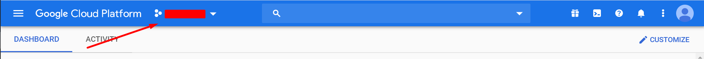
3. Click en NEW PROJECT
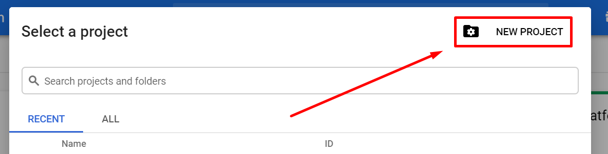
4. Rellena el formulario y haz click en CREATE
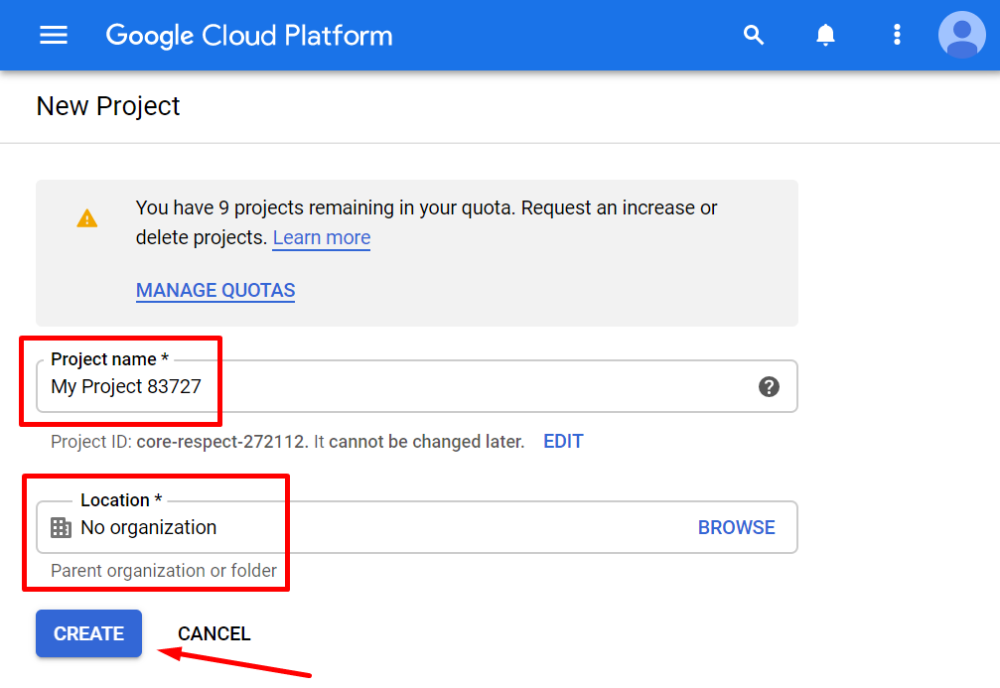

</details>

#### 2.3. Desde la consola de Dialogflow

<details>

Se puede crear también un proyecto automáticamente al crear un agente. Esto se verá más adelante.

</details>

### 3. Habilitar el servicio de dialogflow

Al igual que con la creación del proyecto, también se puede habilitar el servicio de dialogflow:
* Desde una terminal si tienes instalado Google Cloud SDK
* Desde la consola de Google Cloud
* Desde la consola de Dialogflow automáticamente al crear un agente

#### 3.1. Desde una terminal

<details>

Suponiendo que estamos usando [la cuenta que tenemos que usar](#user-checking), para habilitar el servicio de dialogflow desde una terminal hay que seguir los siguientes pasos:

1. Establecer como actual el proyecto del que queremos habilitar el servicio:
    ```
    gcloud config set project <id-del-proyecto>
    ```
    > Puedes comprobar el proyecto actual con este comando:
    > ```sh
    > gcloud config get-value project
    > ```

2. Habilitar el servicio:
    ```
    gcloud services enable dialogflow.googleapis.com
    ```

</details>

#### 3.2. Desde la consola de Google Cloud

<details>

1. Accede a [Google Cloud Console](https://console.cloud.google.com/)

2. En el menú de la izquierda, en APIs & Services, haz click en 'Dashboard'
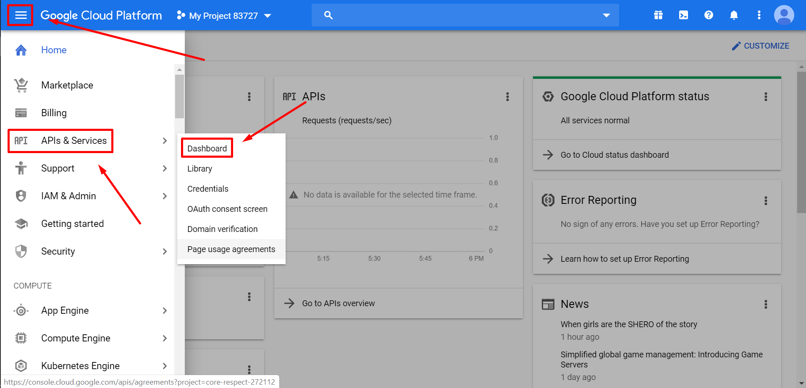

3. Click en el botón '+ ENABLE APIS AND SERVICES'
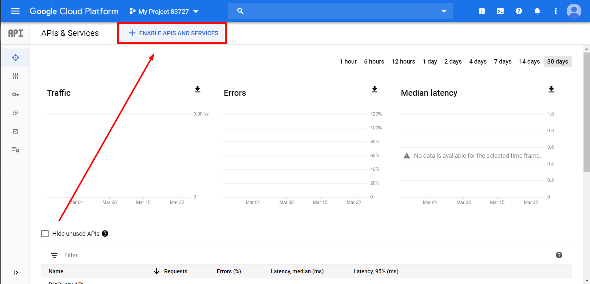

4. En el buscador introduce 'Dialogflow'
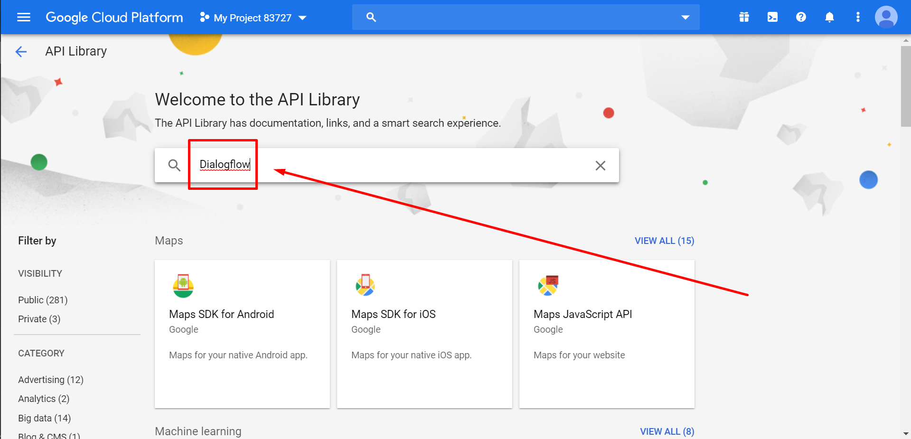

5. Selecciona 'Dialogflow API'
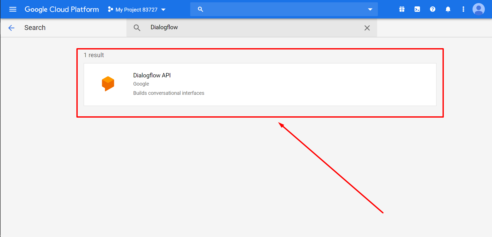

6. Asegurándote de que está seleccionado el proyecto correcto, haz click en 'ENABLE'.
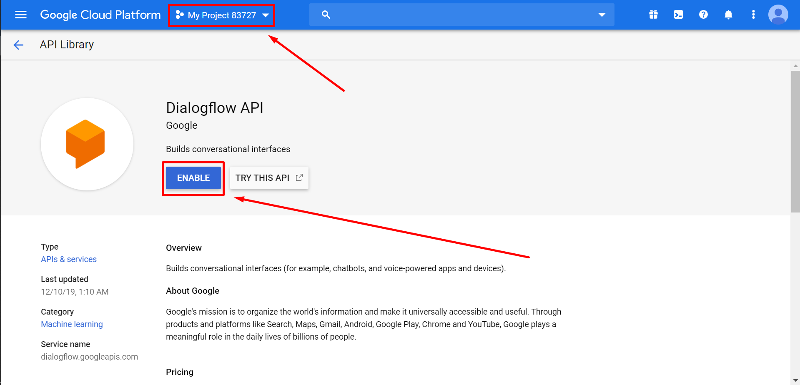

</details>

#### 3.3. Desde la consola de Dialogflow

<details>

El servicio se activa automáticamente al crear un agente, lo cual se verá más adelante.

</details>

### 4. Crear cuenta de servicio, asignar rol y obtener clave privada
Solo es necesario si se va a usar la API y se puede hacer desde una terminal o desde la consola de Google Cloud.

#### 4.1. Desde una terminal

<details>

1. Crear cuenta de servicio
    ```sh
    gcloud iam service-accounts create [NAME] \
        --description "[DESCRIPTION]" \
        --display-name "[DISPLAY-NAME]"
    ```
    > Los parámetros `--description` y `--display-name` son opcionales
    
    Tambien puedes ver las cuentas de servicio que ya estan creadas:

    ```sh
    gcloud iam service-accounts list
    ```

2. Darle un rol a la cuenta de servicio

    Para asignar un rol a una cuenta de servicio:

    ```sh
    gcloud [GROUP] add-iam-policy-binding [RESOURCE] \
        --member [MEMBER] \
        --role [ROLE_ID]
    ```

    Si por ejemplo quisieramos darle el rol `roles/viewer` al usuario `alice@example.com` en el proyecto `my-project`:

    ```sh
    gcloud projects add-iam-policy-binding my-project \
        --member user:alice@example.com \
        --role roles/viewer
    ```

    En nuestro caso se trata de una cuenta de servicio al que, para evitar problemas, le asignaremos el rol `roles/owner` que es el que tiene permisos para hacer cualquier cosa en el proyecto:

    ```sh
    gcloud projects add-iam-policy-binding [PROJECT_ID] \
        --member serviceAccount:[NAME]@[PROJECT_ID].iam.gserviceaccount.com \
        --role roles/owner
    ```

    > Si quieres, puedes ver todos los roles que se pueden asignar con este comando:
    > ```sh
    > gcloud iam list-grantable-roles //cloudresourcemanager.googleapis.com/projects/[PROJECT-ID] > roles.txt
    > ```
    > Una vez ejecutado, se creará un archivo `roles.txt` en el que se muestran todos los roles que se pueden asignar al proyecto.

3. Obtener clave privada
    ```sh
    gcloud iam service-accounts keys create [FILE_NAME].json --iam-account [NAME]@[PROJECT_ID].iam.gserviceaccount.com
    ```

</details>

#### 4.2. Desde la consola de Google Cloud

<details>

1. Accede a [Google Cloud Console](https://console.cloud.google.com/)
2. Menú izquierdo --> APIs & Services --> Credentials
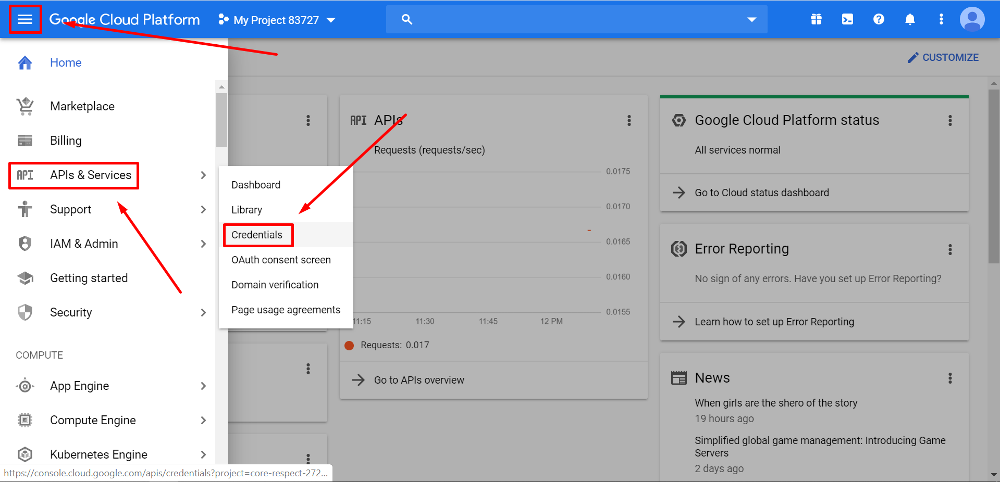
3. CREATE CREDENTIALS --> Service account
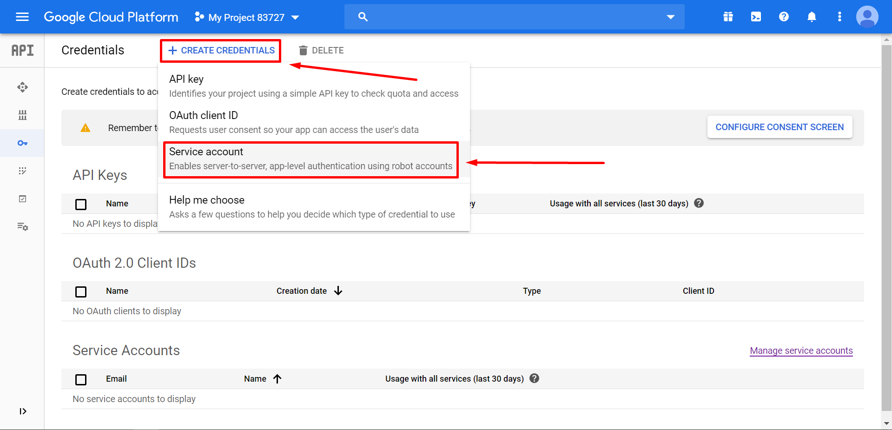
4. Rellena el formulario y haz click en CREATE
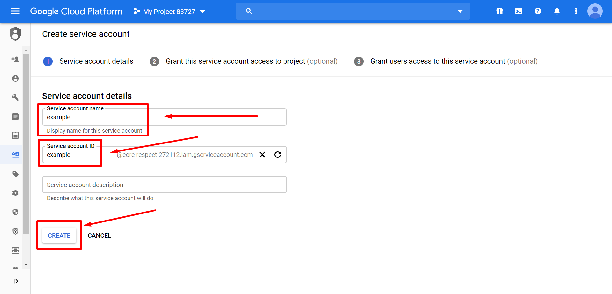
5. Selecciona Project --> Owner para que la cuenta de servicio tenga acceso completo a todos los recursos y luego haz click en CONTINUE
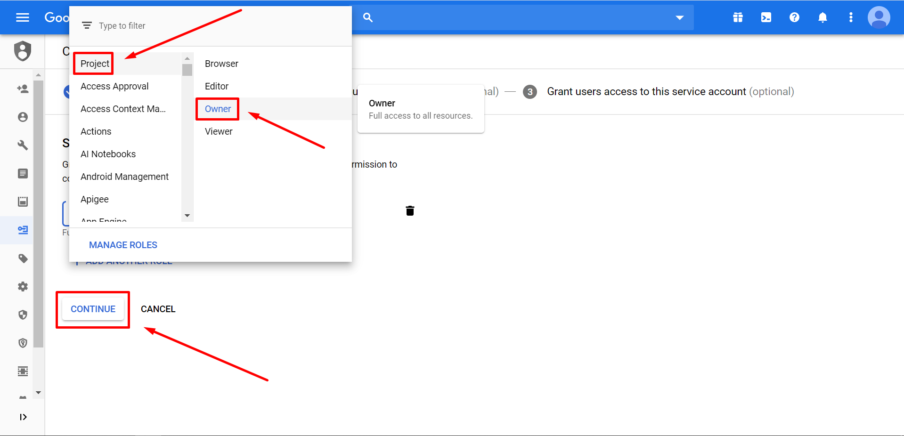
6. Click en CREATE KEY para descargar el archivo, selecciona JSON, click en CREATE y luego click en DONE
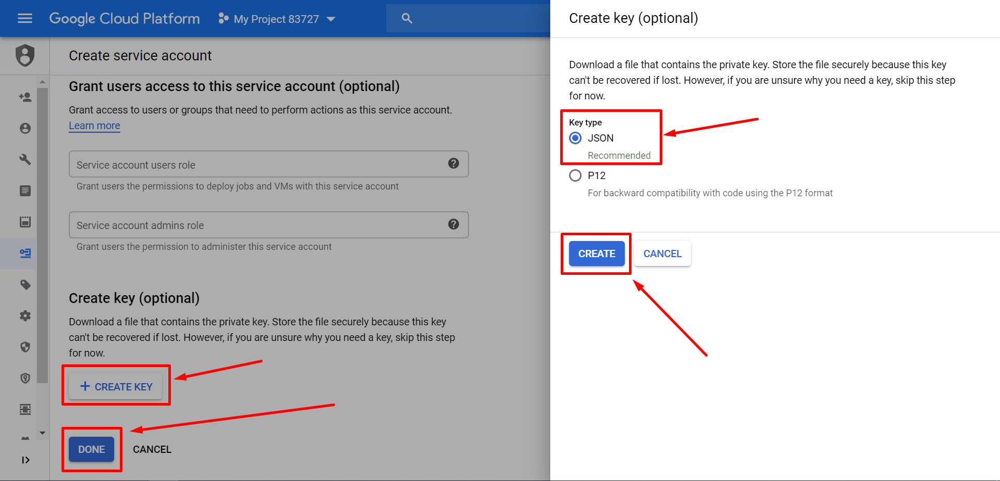

</details>

### 5. Configurar variable de entorno
Hay que crear una variable de entorno llamada GOOGLE_APPLICATION_CREDENTIALS que apunte al archivo de la private key que hemos generado en el paso anterior. De nuevo, solo es necesario si se va a usar la API.

#### Windows:

<details>

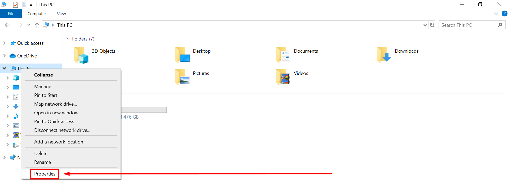
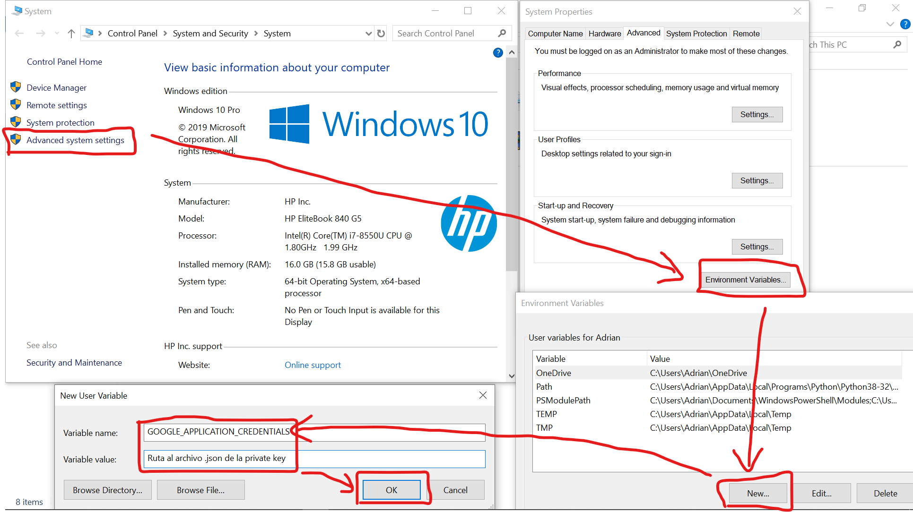

</details>

#### Linux:

<details>

En el archivo `~/.bashrc` hay que añadir al final la siguiente linea:
```sh
GOOGLE_APPLICATION_CREDENTIALS=Ruta_al_archivo_.json_de_la_private_key
```

</details>

En ambos sistemas operativos, al terminar de crear la variable de entorno hay que reiniciar las terminales y programas desde donde estemos ejecutando los comandos para que se tenga en cuenta el cambio.

Para comprobar que todo ha ido bien ejecuta el siguiente comando que deberá imprimir el token de acceso que se usa en la api REST:

```
gcloud auth application-default print-access-token
```

## Desarrollo de agentes

Los agentes de dialogflow se pueden desarrollar usando las siguientes tecnologías:
* API REST
* librerias cliente
* consola de Dialogflow
* protocolo RPC

Puedes ver las referencias en el siguiente enlace:  
https://cloud.google.com/dialogflow/docs/reference

### Crear agente

> Solo puede crearse un agente por cada proyecto de Google

#### Api REST

<details>

Sustituye en el siguiente comando lo siguiente:
* **_project-id_:** Id del proyecto
* **_timezone-value_:** Zona temporal. Por ejemplo: **`Europe/Madrid`**. [Ver zonas temporales](https://cloud.google.com/dataprep/docs/html/Supported-Time-Zone-Values_66194188).
* **_language-code_:** Código del lenguaje. Por ejemplo: **`en`**. [Ver codigos de lenguajes](https://cloud.google.com/dialogflow/docs/reference/language).
* **_agent-name_:** Nombre del agente.
```
curl --request POST \
    --header "Authorization: Bearer $(gcloud auth application-default print-access-token)" \
    --header "Accept: application/json" \
    --header "Content-Type: application/json" \
    --data "{
        'parent': 'projects/project-id',
        'displayName':'agent-name',
        'defaultLanguageCode':'language-code'
        'timeZone':'timezone-value'
    }" \
    "https://dialogflow.googleapis.com/v2/projects/project-id/agent"
```
> Si ya tenias creado un agente en el proyecto, en lugar de crearse otro se actualizará el que ya estaba.

Si obtienes un error como el siguiente:
```
{
    "error": {
        "code": 401,
        "message": "Request is missing required authentication credential. Expected OAuth 2 access token, login cookie or other valid authentication credential. See https://developers.google.com/identity/sign-in/web/devconsole-project.",
        "status": "UNAUTHENTICATED"
    }
}
```

Asegúrate de que la variable de entorno GOOGLE_APPLICATION_CREDENTIALS está apuntando al archivo de las credenciales correcto.

</details>

#### Node.js

<details>

Instala la dependencia de dialogflow:

    npm install @google-cloud/dialogflow

Si el comando anterior lanza un error, prueba con este:

    npm install github:googleapis/nodejs-dialogflow

> También podrías instalar la dependencia de dialogflow con este comando:
> ```sh
> npm install dialogflow
> ```
> Pero entonces no podrás autocompletar código con tu editor de texto, ya que esa libreria no incluye la definición de tipos.

Crea un archivo index.js con el siguiente contenido:

```js
import { AgentsClient } from "@google-cloud/dialogflow";

new AgentsClient().setAgent({
    agent: {
        parent: 'projects/project-id',
        displayName:'agent-name',
        defaultLanguageCode:'',
        timeZone:'timezone-value',
    }
});
```
> Si has usado `npm install dialogflow` para instalar la dependencia entonces sustituye la primera linea de código del archivo index.js por lo siguiente:
> ```js
> import { AgentsClient } from "dialogflow";
> ```

Ejecuta el siguiente comando:

    node index.js

</details>

#### Consola de Dialogflow

<details>

1. Click en Create Agent
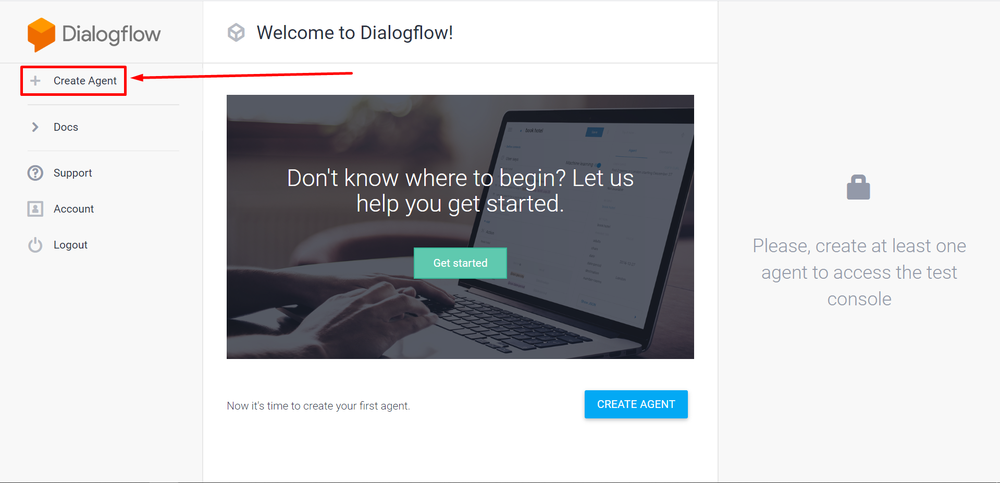
2. Si has creado un proyecto y has activado el servicio de dialogflow en él, aparecerá una lista desplegable en el que poder seleccionarlo. En esa lista desplegable también puedes seleccionar la opción de crear un nuevo proyecto de Google.  
Si no has creado ningún proyecto no aparecerá ninguna lista desplegable. En su lugar aparecerá un texto en el que se aclara que se creará automáticamente un nuevo proyecto de GCP al guardar el agente, como en la imagen del paso 3.
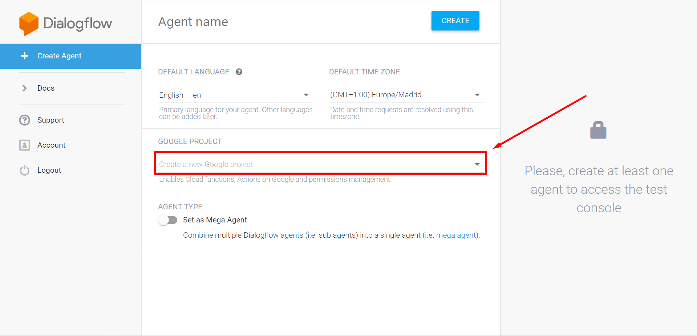
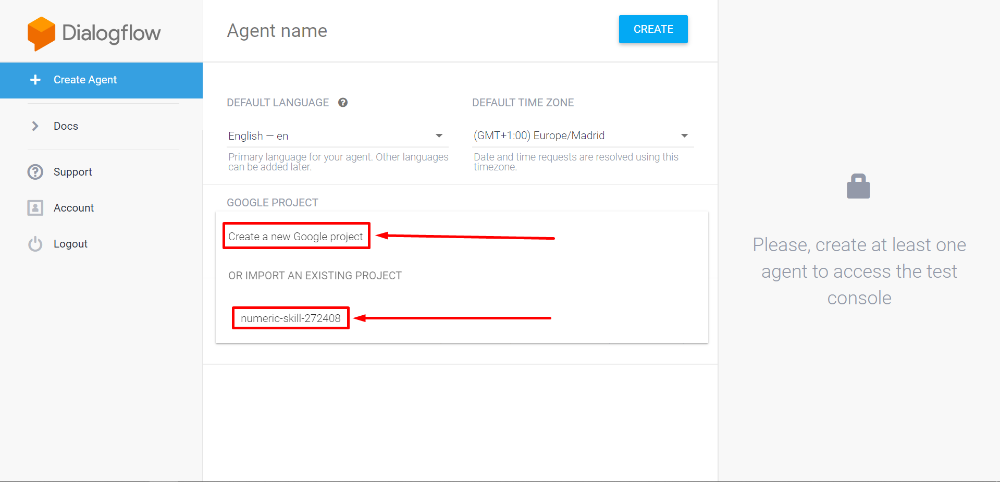
3. Ponle un nombre al agente y selecciona el lenguaje y la zona temporal, y luego haz click en CREATE
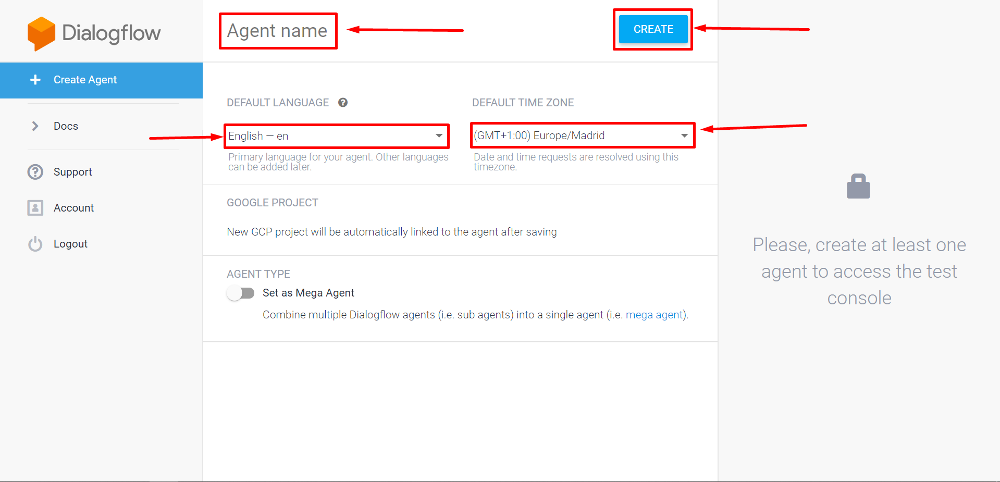

</details>
